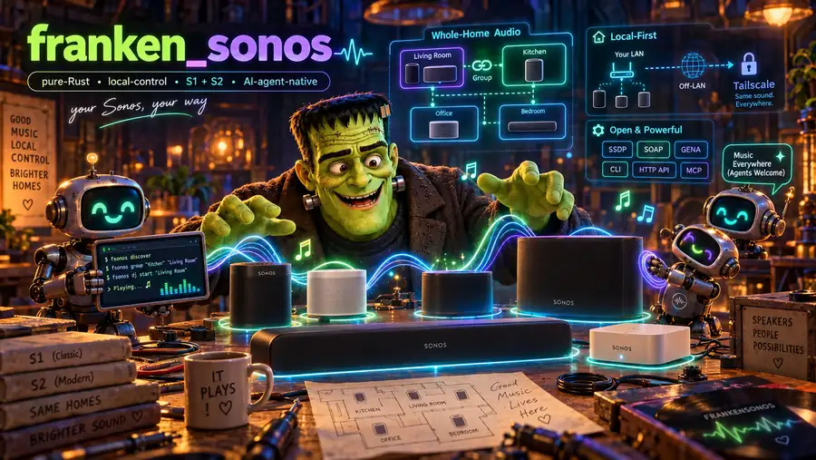

<div align="center">

# FrankenSonos



**Your Sonos, your way. Command your speakers from anywhere in the world, as
long as you're on your Tailscale tailnet.** A memory-safe Rust controller and
daemon for the Sonos speakers you already own: one binary that runs the whole
house from the terminal, an HTTP API, or any AI agent that speaks MCP.


-dea584)


</div>

> **Status: pre-release (before `0.1.0`).** Everything below is implemented,
> and every feature is tested end to end against `fsonos-sim`, a virtual
> Sonos house (an S1 and an S2 household speaking SOAP and GENA on loopback,
> checked against scrubbed captures of real players). Live tests against real
> players exist but are opt-in; there is no real-hardware CI yet, and
> interfaces may still change before `0.1.0`.

---

## Why FrankenSonos

Sonos hardware is excellent and lasts for years; the software around it is
where it falls short. The app loses speakers, grouping fights you, automation
is out of reach, the legacy S1 line is frozen while S2 moves on without it, and
the Spotify Web API cannot start playback on a Sonos at all.

FrankenSonos talks to your speakers directly, over the local protocols they
already speak (SSDP discovery, UPnP/SOAP on port 1400, GENA events), and turns
the whole house, both generations at once, into something you and your agents
can drive:

- **From anywhere on your tailnet.** `fsonos serve` listens on loopback and
  your Tailscale addresses, and `fsonos tailscale setup` puts HTTPS in front of
  it with Tailscale Serve. Your phone in another city, an agent on a cloud VM,
  a laptop at work: if it is on your tailnet, it runs your house. Nothing is
  exposed to the public internet, Funnel is never used, and the speakers never
  leave your LAN.
- **Built for agents, with guardrails.** Every surface (CLI, HTTP, MCP) goes
  through one control path: the house policy (per-room volume caps, quiet
  hours, per-client tool allowlists), an action log of who did what, and undo.
  Hand the house to an agent without it playing volume 80 at 2 a.m.
- **A DJ that plays what you like.** It plays from your own Spotify likes and
  saves, in whatever genres they span (pop, jazz, hip-hop, soundtracks,
  classical), puts your own steering ahead of anything it infers, follows mood
  and time of day, spreads a set across artists, explains every pick, and
  keeps learning from your likes, dislikes, early skips and full listens.
  Classical works play whole, every movement in order. Standing preferences of
  your own — favored and avoided genres, artists and eras, a default energy,
  explicit tracks, pins and bans — override what it infers, on the CLI, HTTP
  and MCP.
- **One memory-safe binary.** Pure Rust 2024 with `#![forbid(unsafe_code)]`,
  on an owned async stack (no Tokio, no reqwest). Nothing is installed on the
  speakers and nothing about them is changed.

## What it does

| Area | What you get |
|---|---|
| **Discovery & topology** | Every player of both S1 and S2 households, its zone group and coordinator. Rooms resolve by name, `Room@S1` / `Room@S2`, your own aliases (`fsonos rooms alias add downstairs Kitchen "Living Room"`), or `here` |
| **Control** | Play a Spotify link, a source URI, a Sonos favorite or a library search; pause, resume, next, previous; room or group volume (set or ±N); mute; group, ungroup; **move** the music to another room (handing the group over, or `--copy` across households); **party** mode for a whole household. Group commands always go to the group's coordinator |
| **Live state** | GENA subscriptions keep a live model of every zone (transport, track, volume), so reads need no polling, and `GET /events` streams the changes as server-sent events |
| **Self-healing** | A player that moved to a new address, or a group whose coordinator changed under a command, is found again and the command retried once (the answer notes `HEALED`); the live model resurveys and resubscribes on its own |
| **DJ** | `dj start` (optionally `--mood`), `skip`, `stop`; picks from your Spotify liked tracks and saved albums, in any genre; a song plays on its own, and a classical work plays whole, every movement in order; varied by artist (or composer), era and time-of-day energy; `dj steer` by mood, artists, keywords (which match genres too), work length or energy, and for classical music by composers and periods, for a while or until cleared; `dj prefs` sets your standing favorites, avoids, default energy and pins or bans; `dj status` and `dj why` explain the pick factor by factor; `dj moods` and your own `moods.toml` programs; `dj like` / `dislike`, early skips and full listens shape later picks |
| **Scenes** | `scene save dinner` captures grouping, volumes, mutes and what each group plays; `scene apply dinner` sends only the steps the house needs, and `fsonos undo` puts it back |
| **Sleep & schedules** | `sleep Bedroom 45m` fades the group out over the last two minutes (with the speaker's own timer as a backstop); `schedule add "weekdays 07:30" dj start Kitchen --mood bright`, or a pause, a volume or a scene, at times or after delays; runs with the rights of whoever added it |
| **Announcements** | `say "Dinner is ready" --rooms Kitchen,Office` (macOS `say`) or `chime bell`, at a policy-capped level, then the music comes back exactly as it was |
| **Safety** | `policy.toml`: per-room caps, a per-step limit, quiet hours, per-client tool allowlists; over-limit volumes are clamped and say so; `fsonos log` / `undo`, `fsonos policy show` / `check` |
| **Setup & diagnosis** | `fsonos setup` walks a first run (including the Spotify sign-in); `fsonos doctor` checks speakers, Spotify linkage, listeners, the daemon and the Tailscale chain, and names the fix for each problem |
| **Three surfaces** | The `fsonos` CLI (`--json` everywhere), an HTTP API with an OpenAPI document, and an MCP server (tools plus `sonos://zones` and `sonos://dj` resources) over streamable HTTP or stdio, all answering alike, with the same stable error codes ([`docs/ERRORS.md`](docs/ERRORS.md)) |
| **A house without speakers** | `fsonos sim` starts virtual S1 and S2 households on loopback, so you can try every command, or develop an agent, with no hardware |

## Quick tour

```bash
fsonos discover                                   # every player on the LAN, S1 and S2
fsonos zones                                      # the groups and what each is doing
fsonos play "Living Room" --favorite "Morning"    # a Sonos favorite (or a URI, or --search "bwv 988")
fsonos volume "Living Room" +5                    # set, or change by ±N; --group for the whole group
fsonos group Office Kitchen                       # Office joins Kitchen's group
fsonos move "Living Room" Bedroom                 # the music follows you
fsonos dj start "Living Room" --mood calm         # the DJ, from your own Spotify taste
fsonos dj why "Living Room"                       # why it chose this pick
fsonos scene save dinner && fsonos scene apply dinner
fsonos sleep Bedroom 45m                          # fade out, then pause
fsonos schedule add "weekdays 07:30" dj start Kitchen --mood bright
fsonos say "Dinner is ready" --rooms Kitchen,Office
fsonos undo                                       # put the newest action back
fsonos serve                                      # the daemon: HTTP API + MCP, loopback and your tailnet
fsonos tailscale setup                            # HTTPS for the tailnet via Tailscale Serve (never Funnel)
fsonos doctor                                     # what is wrong, and how to fix it
```

No speakers handy? Run `fsonos sim` in one terminal; it prints the `--seeds` and
`--routes` flags that point every other command (and `fsonos mcp`) at the
virtual house.

## From anywhere on your tailnet

The daemon is the only thing that leaves your LAN, and only onto your tailnet:

```bash
fsonos serve            # loopback + every tailnet address; prints the connect URLs
fsonos tailscale setup  # Serve: https://<mac>.<tailnet>.ts.net/ (API), :8443/mcp (MCP)
fsonos doctor --only tailscale   # Tailscale up, the MagicDNS name, the daemon answering
```

- `fsonos tailscale setup` maps HTTPS on 443 (API) and 8443 (MCP) to the
  daemon's loopback ports, refuses to run while Funnel is on for either port,
  and never touches Serve config it didn't make (`status`, `teardown`,
  `--dry-run`).
- Behind Serve, the caller's Tailscale login names them: a
  `[clients."alice@example.com"]` table in `policy.toml` sets what that
  person's devices may do, and the action log records who did what.
- Point an agent at it from any tailnet machine:

```bash
claude mcp add --transport http fsonos https://<mac>.<tailnet>.ts.net:8443/mcp
curl https://<mac>.<tailnet>.ts.net/zones
```

The full walkthrough (launchd, the firewall, tailnet policy grants, the
Spotify sign-in) is in [`docs/DEPLOY.md`](docs/DEPLOY.md).

## For agents

`fsonos serve` exposes the house as MCP tools (also `fsonos mcp` over stdio for
a local agent):

```text
reads      list_zones · list_rooms · get_zone_state · list_favorites · search_library
           recent_plays · recent_actions · get_policy · doctor · dj_status · dj_moods
           list_scenes · list_sleep_timers · list_schedules
control    play · play_favorite · pause · resume · next · previous · set_volume · mute
           group · ungroup · move_playback · group_all · announce · undo_last
dj         dj_start · dj_skip · dj_stop · dj_steer · dj_feedback
house      save_scene · apply_scene · set_sleep_timer · add_schedule · pause_schedule
           resume_schedule · remove_schedule
resources  sonos://zones · sonos://zones/{room} · sonos://dj
```

Every HTTP route's operation id is the name of the MCP tool that does the same,
so an agent gets the same answer, and the same error code, either way. The API
documents itself at `GET /openapi.json`.

## Safety for a house run by agents

```toml
# policy.toml in the data directory (a missing file means these defaults)
[defaults]
max_volume = 70        # per room
max_step = 20          # largest single increase

[quiet_hours]          # local time; may wrap midnight
start = "22:00"
end = "07:00"
max_volume = 25

[rooms."Bedroom"]
max_volume = 40

[clients."alice@example.com"]   # a person behind Tailscale Serve
allow = ["list_zones", "get_zone_state", "play", "set_volume"]
```

- One choke point: every mutating call on every surface is authorized,
  snapshotted, carried out under the policy, and logged with who asked, the
  verdict (allow, clamp or deny) and what happened.
- `fsonos undo` (`undo_last`) restores the volumes, grouping and what was
  playing in the zones the newest action changed, and says what it could not.
- Callers the daemon cannot identify get read-only tools; the API and MCP
  listeners refuse wildcard and public binds (unless you pass
  `--allow-unsafe-bind`); the HTTP API checks Host and Origin and accepts
  writes only as JSON.

## Design

- **Pure where it can be.** SSDP, SOAP, GENA and DIDL encoding, planning, the
  policy, scene diffs, schedules and the DJ's picks are pure functions, unit
  tested without a network; I/O sits behind narrow traits.
- **Events, not polling.** The live model follows GENA, renews subscriptions,
  and resurveys when the house changes; group-wide commands are addressed to
  the coordinator automatically.
- **S1 and S2 together.** Each player's generation is recorded, and the code
  branches only where the protocols differ; S1 and S2 rooms never share a
  group, and the commands say so instead of failing quietly.
- **End to end against a simulator.** `fsonos-sim` serves the real protocols
  on loopback (queues, favorites, GENA, sleep timers, media fetches, a clock
  tests can move), and the e2e suite drives the real `fsonos` binary against
  it, logging every step as JSON lines.
- **No site data.** Your rooms, addresses and tokens are learned at runtime and
  stored locally; the repository holds none of them.

## Architecture

```
            SSDP / UPnP-SOAP / GENA (your LAN, port 1400)
                              │
          ┌───────────────────▼───────────────────┐
          │  fsonos-proto   discovery · SOAP ·     │
          │                 events · DIDL/URIs     │
          └───────────────────┬───────────────────┘
                              │
          ┌───────────────────▼───────────────────┐   ┌────────────────┐
          │  fsonos-core    inventory · live model │   │ fsonos-spotify │
          │   policy · scenes · schedules · store  │◄──┤ library + DJ   │
          └───────────────────┬───────────────────┘   └───────┬────────┘
                              │                               │
   ┌──────────────┬───────────┼───────────────┐       Spotify Web API
   ▼              ▼           ▼               ▼       (read-only, your account)
fsonos-api     fsonos-mcp   fsonos-cli    fsonos-tailscale
(HTTP API)    (MCP tools)   (`fsonos`)    (tailnet presence)
```

| Crate | Responsibility |
|---|---|
| `fsonos-types` | Shared domain vocabulary (players, groups, tracks) |
| `fsonos-proto` | SSDP, UPnP/SOAP, GENA events, DIDL-Lite and URIs |
| `fsonos-core` | Inventory, the live model, grouping, moving, policy, snapshots and undo, scenes, schedules, sleep timers, announcements, the doctor, the local store |
| `fsonos-spotify` | Read-only Spotify library sync and the DJ: works, picks, steering, feedback |
| `fsonos-api` | The shared surface (requests, planning, policy, logging) and the HTTP API (`fastapi_rust`) |
| `fsonos-mcp` | The MCP server and its tools and resources (`fastmcp_rust`) |
| `fsonos-cli` | The `fsonos` binary: the CLI, `serve`, `setup`, `doctor`, `sim` |
| `fsonos-tailscale` | Is this host on a tailnet, at which addresses and name; connect URLs; who a tailnet caller is |
| `fsonos-sim` | The virtual Sonos house the tests (and `fsonos sim`) run against |

Built on the author's Rust stack: [`asupersync`](https://github.com/Dicklesworthstone/asupersync)
(async runtime), [`fsqlite`](https://github.com/Dicklesworthstone/frankensqlite)
(local store), [`fastmcp_rust`](https://github.com/Dicklesworthstone/fastmcp_rust),
and [`fastapi_rust`](https://github.com/Dicklesworthstone/fastapi_rust). The full
design is in [`COMPREHENSIVE_PLAN_FOR_FRANKENSONOS.md`](COMPREHENSIVE_PLAN_FOR_FRANKENSONOS.md).

## Installation

No prebuilt binaries yet (pre-release). Build from source:

```bash
git clone https://github.com/Dicklesworthstone/frankensonos
cd frankensonos
cargo build --release      # the toolchain is pinned in rust-toolchain.toml
cargo test --workspace     # unit, golden and end-to-end tests (no speakers needed)
```

The binary is `target/release/fsonos`. Run it on a machine on the same LAN as
your speakers; for access from anywhere, that machine also joins your tailnet.
`fsonos setup` takes it from there. To run the daemon at boot, see
[`docs/DEPLOY.md`](docs/DEPLOY.md) (launchd plus Tailscale).

## Roadmap

Shipped: discovery and topology across S1 and S2, coordinator-addressed control
and grouping, the GENA live model and self-healing, the DJ (drawing on
everything you save or like on Spotify, plus your top tracks, recent plays and
own playlists, in any genre) with your standing preferences, steering,
explanations and feedback, scenes, sleep timers and schedules, announcements,
the house policy with quiet hours, the action log and undo, `doctor` and
`setup`, the simulator, and the CLI, HTTP API and MCP server, on loopback and
your tailnet. The CLI goes through a running daemon when there is one, with
room-name completions for zsh, bash and fish, and the daemon serves a web
remote (rooms, now playing with album art, volume, the DJ and scenes) to any
device on your tailnet.

Next:

- The daemon refreshing your Spotify library on its own, on a schedule (today
  a running daemon picks up new saves, likes and taste signals after you re-run
  `fsonos setup`).
- `dj steer` by genre and decade on the CLI, HTTP and MCP. The DJ already
  steers by them in `moods.toml` and favors or avoids them in your
  preferences.
- Real-hardware CI, then `0.1.0` with prebuilt binaries.

## Scope & privacy

FrankenSonos controls hardware you own, on your own network, and reads your own
Spotify library with your own credentials (read-only, PKCE). It never writes
to device firmware or changes anything on the speakers, and it handles no
secrets beyond your own local OAuth cache. This repository is public and
contains no site data (addresses, serials, tokens, room lists); all of that is
learned at runtime and kept locally. The full boundary is in
[`docs/SCOPE.md`](docs/SCOPE.md).

## Limitations

- It is pre-release: simulator-verified end to end, with opt-in live tests but
  no real-hardware CI yet. Expect interfaces to change until `0.1.0`.
- Sonos plays Spotify through its own music-service integration; the Spotify
  Web API is only used to read your library. Spotify must be linked once in
  each household's Sonos app, and the per-household render parameters are
  learned from your own Sonos favorites. Rendering on legacy S1 players is
  still being confirmed on real hardware.
- The DJ's taste comes from your liked tracks and saved albums, plus your top
  tracks, recent plays and own playlists, leaning toward the artists you follow
  and play most (read-only scopes you grant at sign-in; without them it uses
  your library alone, and `doctor` says so). `dj steer`, standing preferences
  and `moods.toml` are your overrides. Spotify gives new apps no audio
  features, so a song's energy comes from its artists' genre tags, and a
  classical movement's from its tempo marking. A library cached before the DJ
  played every genre needs one re-sync (`fsonos setup`) before the rest of it
  joins the pool.
- You run the daemon on a machine on your speaker LAN (a Mac mini, a Pi, a
  NAS). The deploy docs and announcements' speech (`say`) are macOS-first.
- Until the CLI talks to a running daemon, `fsonos sleep` on its own sets the
  speaker's own timer (no fade); the fade comes through the daemon (HTTP, MCP).
- The API and MCP server have no authentication of their own: Tailscale is the
  boundary. Callers on a direct tailnet listener are read-only until tailnet
  identity reaches them; use Serve for full control, where the caller's login
  is their identity.

## FAQ

**Does this replace the Sonos app?** For day-to-day control, grouping, the DJ,
scenes, schedules and announcements, yes. You still link Spotify once in the
official app so Sonos can render it.

**Does it modify my speakers or their firmware?** No. It sends them the same
local control requests a controller always has. Nothing is flashed or changed
on the devices.

**Why can't it just use the Spotify API to play music?** The Spotify Web API
cannot target a Sonos renderer. Sonos plays Spotify through its own
integration, so FrankenSonos builds the right `x-sonos-spotify:` request for
*your* household, from parameters learned from your own favorites.

**S1 and S2 at once?** Yes. Both households appear together, every command
addresses the right one, and `Room@S1` / `Room@S2` picks between rooms with the
same name.

**Can my AI agent control it from another city?** Yes, over your Tailscale
tailnet: the agent reaches the daemon, and the daemon reaches the speakers on
the LAN. The house policy bounds what it may do, and `undo` puts it back.

**Can I try it without Sonos speakers?** Yes: `fsonos sim` runs a virtual S1
and S2 house on loopback, and every command and the MCP server work against it.

**What streaming services work?** Spotify first, plus anything you have saved
as a Sonos favorite (stations, playlists, other services). The control layer
is source-agnostic.

## About Contributions

Please don't take this the wrong way, but I do not accept outside contributions
for any of my projects. I simply don't have the mental bandwidth to review
anything, and it's my name on the thing, so I'm responsible for any problems it
causes; thus, the risk-reward is highly asymmetric from my perspective. I'd also
have to worry about other "stakeholders," which seems unwise for tools I mostly
make for myself for free. Feel free to submit issues, and even PRs if you want to
illustrate a proposed fix, but know I won't merge them directly. Instead, I'll
have Claude or Codex review submissions via `gh` and independently decide whether
and how to address them. Bug reports in particular are welcome. Sorry if this
offends, but I want to avoid wasted time and hurt feelings. I understand this
isn't in sync with the prevailing open-source ethos that seeks community
contributions, but it's the only way I can move at this velocity and keep my
sanity.

## License

MIT License with an OpenAI/Anthropic rider; see [`LICENSE`](LICENSE).
(`LicenseRef-MIT-OpenAI-Anthropic-Rider`; not plain MIT.)
